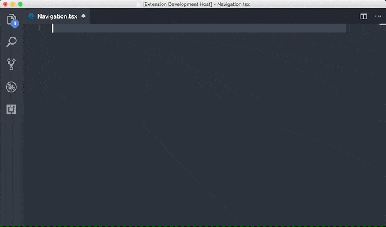

# SharePoint Framework Snippets

This extension for Visual Studio Code adds snippets for SharePoint Framework solution development. It contains snippets for working in:
- JavaScript (resource files)
- React
- SASS (SCSS)
- TypeScript
- JSON

See the [changelog](./CHANGELOG.md) for the latest changes.

## Usage

Type part of a snippet and press `enter`, the code will then be added into the file. Or press `Ctrl`+`Space` (Windows, Linux) or `Cmd`+`Space` (macOS) to activate snippets from within the editor.

### React

| Snippet | Purpose |
|---------|---------|
| `spfx-rcc` | Creates a new React Component. |
| `spfx-rcc-state` | Creates a new React Component with state initialization. |
| `spfx-con` | Adds a React `constructor` method. |
| `spfx-ist` | Initializes the React state. |
| `spfx-sst` | Adds the `setState` block. |
| `spfx-ucst` | Adds the `setState` block to correctly update the state based on previous value. |
| `spfx-cwm` | Add `componentWillMount` method which is invoked before the component mounting happens. |
| `spfx-cdm` | Add `componentDidMount` method which is invoked after the component mounting and rendering happened. |
| `spfx-cwrp` | Add `componentWillReceiveProps` method which is invoked before a mounted component receives new prop. |
| `spfx-scu` | Add `shouldComponentUpdate` method which can be used to let your component know the output is not affected by the current change in state or props. |
| `spfx-cwu` | Adds `componentWillUpdate` method which is invoked just before rendering when new props or state are retrieved. |
| `spfx-cwu` | Adds `componentDidUpdate` method which is invoked just after rendering when new props or state are retrieved. |

### TypeScript

| Snippet | Purpose |
|---------|---------|
| `spfx-locale-ts` | Defines the content to create a new localization definition file. |
| `spfx-wpinit` | Defines the web part `onInit` method. |
| `spfx-render-elm` | Adds the code required to create and render a React component. |

### TypeScript & React

| Snippet | Purpose |
|---------|---------|
| `spfx-sp-get` | Adds `SPHttpClient` get request. |
| `spfx-http-get` | Adds `HttpClient` get request. |
| `spfx-spget-import` | Adds `SPHttpClient` required import statement. |
| `spfx-graph-get` | Adds code for the `MSGraphClient` get request. |
| `spfx-aad-get` | Adds code for the `AadHttpClient` get request. |

### SASS (scss)

| Snippet | Purpose |
|---------|---------|
| `spfx-fabcore` | Includes the Office UI Fabric Core styles into your SASS file. |
| `spfx-fabreact` | Includes the core styles from the Office UI Fabric React package into your SASS file. |
| `spfx-color-*` | Includes the color variable of your choice. Example: `spfx-color-themeDarker` adds `$ms-color-themeDarker`. |
| `spfx-font` | Includes the font styling and allows you to choose the size. |
| `spfx-fontWeight` | Includes the font weight styling and allows you to choose the weight. |
| `spfx-fontSize` | Includes the font size styling and allows you to choose the size. |
| `spfx-grid` | Includes grid styling: `@include ms-Grid;`. |
| `spfx-grid-row` | Includes grid row styling: `@include ms-Grid-row;`. |
| `spfx-grid-col` | Includes grid column styling: `@include ms-Grid-col;`. |
| `spfx-grid-sm*` | Includes small grid and lets you choose the size between 1 - 12. |
| `spfx-grid-md*` | Includes medium grid and lets you choose the size between 1 - 12. |
| `spfx-grid-lg*` | Includes large grid and lets you choose the size between 1 - 12. |
| `spfx-grid-xl*` | Includes x-large grid and lets you choose the size between 1 - 12. |
| `spfx-grid-xxl*` | Includes xx-large grid and lets you choose the size between 1 - 12. |
| `spfx-grid-xxxl*` | Includes xxx-large grid and lets you choose the size between 1 - 12. |

### JavaScript

| Snippet | Purpose |
|---------|---------|
| `spfx-locale-js` | Defines the content to create a new localization definition file. |
| `spfx-gulp-task` | Defines the content for a new Gulp task. |
| `spfx-gulp-subtask` | Defines the content for a new Gulp sub-task. |
| `spfx-webpack` | Defines the content extending the webpack configuration. |

### JSON

| Snippet | Purpose |
|---------|---------|
| `spfx-webapi` | Includes the `webApiPermissionRequests` property with `Microsoft Graph` as the resource. |
| `spfx-add-permission` | Includes a new permission object (resource + scope). |
| `spfx-scope-calendar` | Include one of the Microsoft Graph `calendar` scopes (CHOICE). |
| `spfx-scope-contacts` | Include one of the Microsoft Graph `contacts` scopes (CHOICE). |
| `spfx-scope-directory` | Include one of the Microsoft Graph `directory` scopes (CHOICE). |
| `spfx-scope-files` | Include one of the Microsoft Graph `files` scopes (CHOICE). |
| `spfx-scope-group` | Include one of the Microsoft Graph `group` scopes (CHOICE). |
| `spfx-scope-mail` | Include one of the Microsoft Graph `mail` scopes (CHOICE). |
| `spfx-scope-sites` | Include one of the Microsoft Graph `sites` scopes (CHOICE). |
| `spfx-scope-tasks` | Include one of the Microsoft Graph `tasks` scopes (CHOICE). |
| `spfx-scope-user` | Include one of the Microsoft Graph `user` scopes (CHOICE). |

## Feedback and snippet ideas

Feedback and/or snippet ideas are always welcome. Please submit them via creating an issue in the extension repository: [issue list](https://github.com/estruyf/vscode-spfx-snippets/issues).